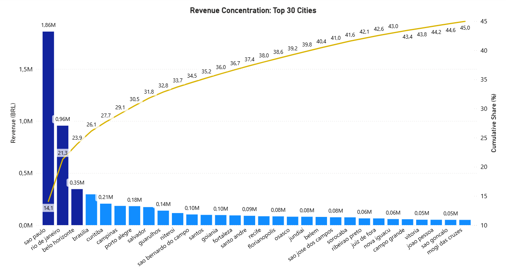

# Olist E-commerce: Pareto Analysis of Brazilian Cities

## Project Overview
This project analyzes the real-world **Olist Brazilian E-Commerce dataset (2016-2018)**. The primary goal was to identify the geographic concentration of revenue and determine which cities are the core drivers of the business using **Pareto Analysis (80/20 rule)**.

## Tools & Technologies Used
* **Database:** MySQL
* **Techniques:** Advanced SQL (Common Table Expressions - CTEs, Window Functions `SUM() OVER()`, `ROW_NUMBER()`, Data Aggregation)
* **Data Visualization:** Power BI (Pareto Chart, Custom Formatting, Data Storytelling)

## The Business Problem
Olist delivers to over 4,000 unique cities across Brazil. Spreading marketing and logistics budgets evenly across all regions is inefficient. The objective was to find the "Top N" cities that generate the most significant portion of total revenue to optimize business focus.

## Key Findings & Dashboard
By applying a Pareto analysis, I discovered a massive geographic concentration in sales:
* **Less than 1%** of all Brazilian cities (the Top 30) generate **45% of total revenue**.
* The top 3 cities (**São Paulo, Rio de Janeiro, and Belo Horizonte**) alone are the absolute powerhouse of the market.

 

## SQL Logic
To calculate the running total and cumulative percentage, I used nested CTEs and Window Functions. This approach ensures the logic is modular, readable, and performant.

You can view the full, commented SQL script in the [`pareto_analysis.sql`](pareto_analysis.sql) file.
